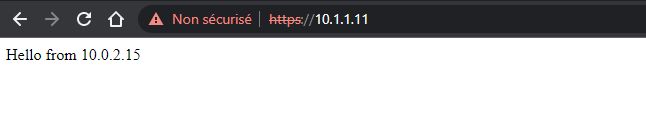

# TP1 : Vagrant et Ansible

Dans ce TP on va commencer à se f**amiliariser avec un environnement Vagrant + Ansible** qui nous permettra d'avoir un environnement dans lequel travailler par la suite.

➜ *Vagrant* nous permettra de gérer des VMs via des fichiers texte. Il sera ainsi aisé d'allumer plusieurs VMs, les conf, les détruire, et réitérer.

➜ *Ansible* sera utilisé pour déposer de la configuration sur les machines que l'on aura préalablement créées.

> Les deux sont des outils libres et opensource.

## Sommaire

- [TP1 : Vagrant et Ansible](#tp1--vagrant-et-ansible)
  - [Sommaire](#sommaire)
- [0. Git](#0-git)
- [I. Setup Vagrant](#i-setup-vagrant)
  - [1. Installation](#1-installation)
  - [2. Une première VM](#2-une-première-vm)
  - [3. Config initiale](#3-config-initiale)
- [II. Ansible](#ii-ansible)
  - [1. Mise en place](#1-mise-en-place)
  - [2. La commande `ansible`](#2-la-commande-ansible)
  - [3. Un premier playbook](#3-un-premier-playbook)
  - [3. Création de nouveaux playbooks](#3-création-de-nouveaux-playbooks)
    - [A. NGINX](#a-nginx)
    - [B. MariaDB](#b-mariadb)
- [III. Utilisation et vérifications](#iii-utilisation-et-vérifications)
  - [1. Déploiement des VM avec Vagrant](#1-déploiement-des-vm-avec-vagrant)
  - [2. Déploiement du serveur web avec Ansible](#2-déploiement-du-serveur-web-avec-ansible)
    - [Vérification](#vérification)
  - [3. Déploiement de MariaDB avec Ansible](#3-déploiement-de-mariadb-avec-ansible)
    - [Vérifier que la base de données tp1_db a été créé](#vérifier-que-la-base-de-données-tp1_db-a-été-créé)
	- [Se connecter à la VM2 et vérifier que notre utilisateur a été créé :](#se-connecter-à-la-vm2-et-vérifier-que-notre-utilisateur-a-été-créé-)
	- [Vérifier que l'utilisateur "tp1_dbuser" possède tous les privilèges d'administration :](#vérifier-que-lutilisateur-tp1_dbuser-possède-tous-les-privilèges-dadministration-)
	- [Vérifier que l'utilisateur "root" possède tous les droits sur la base de données "tp1_db" :](#vérifier-que-lutilisateur-root-possède-tous-les-droits-sur-la-base-de-données-tp1_db-)

# 0. Git

➜ **Créez dès maintenant un dépôt Git** sur la plateforme de votre choix (Gitlab, Github, etc.).

Vous l'utiliserez pour travailler sur vos TPs et il fera office de rendu de TP.

# I. Setup Vagrant

## 1. Installation

➜ **Installez Vagrant** en suivant [la doc officielle](https://developer.hashicorp.com/vagrant/downloads).

Vagrant n'est qu'une surcouche à un hyperviseur préalablement mis en place. Je vous recommande d'utiliser [VirtualBox](https://www.virtualbox.org/) pour ce cours.

> En plus d'être libre et opensource, Virtualbox est cross-platform.

Vagrant définit la notion de *box* : c'est juste une VM prête à être clonée et configurée par Vagrant. On peut instancier une box plusieurs fois afin de créer plusieurs VMs.

> Il existe un répertoire public de *box* Vagrant : le [Vagrant Cloud](https://app.vagrantup.com/boxes/search).

## 2. Une première VM

Pour utiliser Vagrant, cela se fait depuis le terminal. Ouvrez donc un terminal sur votre OS.

Je vous recommande Git Bash si vous êtes sur Windows.

> Dans ce TP, les machines virtuelles que nous créerons seront des Rocky Linux 9. C'est un OS libre et opensource, basé sur RHEL. L'accent est mis sur la sécurité et la robustesse avant tout au sein de ces OS.

➜ **Préparons le terrain pour la première VM**

```bash
# déplacez-vous dans votre dépôt git
$ cd /path/to/git/repo

# créez un dossier pour ce tp, et un sous dossier vagrant
$ mkdir -p tp1/vagrant
$ cd tp1/vagrant

# générez un fichier Vagrantfile initial
$ vagrant init generic/rocky9

# un fichier Vagrantfile a été créé dans le dossier courant
# explorez son contenu
$ cat Vagrantfile
```

Avec ce fichier basique, il est possible d'allumer une simple VM. On peut trouver en commentaire les lignes de conf nécessaires pour définir par exemple une adresse IP privée pour notre VM.

Feu.

```bash
# on allume la VM
$ vagrant up 

# voir le statut de la VM
$ vagrant status

# une fois terminé, on peut SSH vers notre VM facilement avec :
$ vagrant ssh

# si vous voulez voir les paramètres de la commande SSH effectuée par Vagrant vous pouvez utiliser
$ vagrant ssh-config

# enfin vous pouvez éteindre et détruire la VM avec
$ vagrant halt
$ vagrant destroy -f
```

> Vous pouvez aussi constater que la VM est allumée dans votre hyperviseur.

## 3. Config initiale

**Vagrant, en plus la création de VM, permet aussi de déposer de la configuration une fois que la VM est allumée.**

Dans notre cas, c'est idéal pour installer le nécessaire afin de pouvoir bosser sur Ansible par la suite.

Une fois une VM configurée, Vagrant permet aussi de créer une nouvelle box de base, quu'on pourra de nouvea instancier par la suite, qui contiendra nos modifications.

**Concrètement, dans cette partie** :

- on va allumer une VM avec Vagrant
- demander à Vagrant d'exécuter un script une fois la VM allumée :
  - mettre à jour l'OS
  - installer Ansible
- packager cette VM comme une nouvelle box

Ainsi, par la suite, on pourra instancier de nouvelles VMs qui auront déjà Ansible installé.

➜ **Modifiez votre `Vagrantfile`** pour qu'il ressemble à :

```ruby
Vagrant.configure("2") do |config|
  config.vm.box = "generic/rocky9"

  config.vm.provider "virtualbox" do |vb|
    # Display the VirtualBox GUI when booting the machine
    vb.gui = true
  
    # Customize the amount of memory on the VM:
    vb.memory = "1024"
  end

  # Désactive les updates auto qui peuvent ralentir le lancement de la machine
  config.vm.box_check_update = false 

  # La ligne suivante permet de désactiver le montage d'un dossier partagé (ne marche pas tout le temps directement suivant vos OS, versions d'OS, etc.)
  config.vm.synced_folder ".", "/vagrant", disabled: true
  
  # Exécution d'un script au démarrage de la VM
  config.vm.provision "shell", path: "setup.sh"
end
```

➜ Créez, à côté du `Vagrantfile` **un fichier `setup.sh`** avec le contenu suivant :

```bash
# init script for Vagrant VMs

# update OS
dnf update -y

# install ansible
dnf install -y ansible

# désactive SELinux
setenforce 0
sed -i 's/SELINUX=enforcing/SELINUX=permissive/g' /etc/selinux/config
```

> Vous pourrez ajouter des éléments à ce script si nécessaire par la suite. C'est notre script d'initialisation de la machine.

➜ **Vous pouvez `vagrant up`** pour dérouler l'install, avec l'exécution du script en plus.

---

➜ On va maintenant repackager cette VM en une nouvelle box, qui contiendra déjà notre update ainsi que l'installation de Ansible.

```bash
# toujours depuis le même répertoire, avec la VM allumée
$ vagrant package --output rocky-ynov.box

# on ajoute le fichier .box produit à la liste des box que gère Vagrant
$ vagrant box add rocky-ynov rocky-ynov.box

# la box est visible dans la liste des box Vagrant
$ vagrant box list
```

# II. Ansible

*Ansible* sera notre outil de gestion de conf principal.

➜ Pour qu'Ansible fonctionne il nous faut :

- du code Ansible
- des machines sur lesquelles déposer de la conf
  - ce sera des machines Vagrant
  - Ansible et Python installés
  - un serveur SSH dispo
- une machine qui possède le code Ansible
  - ce sera votre PC
  - cette machine doit pouvoir se connecter sur les machines de destination en SSH
  - utilisation d'un utilisateur qui a accès aux droits `root` via la commande `sudo`

Une fois en place, on pourra rédiger nos premiers *playbooks*.

## 1. Mise en place

➜ **Ajustez votre `Vagrantfile`** pour que

- il crée 2 VMs
- chacune doit avoir une adresse IP privée dans le réseau `10.1.1.0/24`
  - une en `10.1.1.11` l'autre en `10.1.1.12`
- modifiez le script `setup.sh` pour que les VMs créées :
  - aient Ansible et Python installés
  - aient un user qui a accès aux droits `root` avec la commande `sudo`
    - je vous conseille une conf en `NOPASSWD` pour ne pas avoir à saisir votre password à chaque déploiement
  - ce user a une clé publique pour vous y connecter sans mot de passe

➜ **Installez Ansible sur votre machine**

- il vous faudra aussi Python
- suivez [la doc officielle pour l'install](https://docs.ansible.com/ansible/latest/installation_guide/index.html)

➜ **Créez un nouveau répertoire `tp1/ansible/` dans votre dépôt git**

- il accueillera le code Ansible pour ce TP

➜ **Préparez la connexion Ansible aux VMs**

- créez un fichier `.ssh-config` avec le contenu suivant

```ssh-config
Host 10.1.1.*
  User <VOTRE_USER>
  IdentityFile <VOTRE_CLE_PRIVEE>
  UserKnownHostsFile /dev/null
  StrictHostKeyChecking no
  PasswordAuthentication no
  IdentitiesOnly yes
  LogLevel FATAL
```

- créez un fichier `ansible.cfg` avec le contenu suivant

```ini
[ssh_connection]
ssh_args = -F ./.ssh-config
```

## 2. La commande `ansible`

On va enfin utiliser un peu Ansible !

➜ Pour cela, **créez un fichier `hosts.ini`** avec le contenu suivant :

```ini
[tp1]
10.1.1.11
10.1.1.12
```

On va commencer avec quelques commandes Ansible pour exécuter des tâches *ad-hoc* : c'est à dire des tâches one shot depuis la ligne de commandes.

```bash
# lister les hôtes que Ansible voit dans notre inventaire
$ ansible -i hosts.ini tp1 --list-hosts

# tester si ansible est capable d'interagir avec les machines
$ ansible -i hosts.ini tp1 -m ping

# afficher toutes les infos que Ansible est capable de récupérer sur chaque machine
$ ansible -i hosts.ini tp1 -m setup

# exécuter une commande sur les machines distantes
$ ansible -i hosts.ini tp1 -m command -a 'uptime'

# exécuter une commande en root
$ ansible -i hosts.ini tp1 --become -m command -a 'reboot'
```

## 3. Un premier playbook

Enfin, on va écrire un peu de code Ansible.  
On va commencer simple et faire un *playbook* en un seul fichier, pour prendre la main sur la syntaxe, et faire un premier déploiement.

➜ **créez un fichier `first.yml`**, notre premier *playbook* :

```yaml
---
- name: Install nginx
  hosts: tp1
  become: true

  tasks:
  - name: Install nginx
    dnf:
      name: nginx
      state: present

  - name: Insert Index Page
    template:
      src: index.html.j2
      dest: /usr/share/nginx/html/index.html

  - name: Start NGiNX
    service:
      name: nginx
      state: started
```

> Chaque élément de cette liste YAML est donc une *task* Ansible. Les mots-clés `yum`, `template`, `service` sont des *modules* Ansible.

➜ **Et un fichier `index.html.j2` dans le même dossier**

```jinja2
Hello from {{ ansible_default_ipv4.address }}
```

➜ **Exécutez le playbook**

```bash
$ ansible-playbook -i hosts.ini first.yml
```

## 3. Création de nouveaux playbooks

### A. NGINX

➜ **Créez un *playbook* `nginx.yml`**

- déploie un serveur NGINX
- générer un certificat et une clé au préalable
  - le certificat doit être déposé dans `/etc/pki/tls/certs`
  - la clé doit être déposée dans `/etc/pki/tls/private`
- créer une racine web et un index
  - créez le dossier `/var/www/tp1_site/`
  - créez un fichier à l'intérieur `index.html` avec un contenu de test
- déploie une nouveau fichier de conf NGINX
  - pour servir votre `index.html` en HTTPS (port 443)
- ouvre le port 443/TCP dans le firewall

➜ **Modifiez votre `hosts.ini`**

- ajoutez une section `web`
- elle ne contient que `10.1.1.11`

➜ **Lancez votre playbook sur le groupe `web`**

➜ **Vérifiez que vous accéder au site avec notre navigateur**

> S'il y a besoin d'aide pour tout ça, si vous n'êtes pas du tout familier avec la conf NGINX, n'hésitez pas à faire appel à moi.

### B. MariaDB

➜ **Créez un *playbook* `mariadb.yml`**

- déploie un serveur MariaDB
- créer un user SQL ainsi qu'une base de données sur laquelle il a tous les droits

➜ **Modifiez votre `hosts.ini`**

- ajoutez une section `db`
- elle ne contient que `10.1.1.12`

➜ **Lancez votre playbook sur le groupe `db`**

➜ **Vérifiez en vous connectant à la base que votre conf a pris effet**


# III. Utilisation et vérifications

## 1. Déploiement des VM avec Vagrant
Se rendre dans le dossier "TP1/Vagrant" : ~~Cloud-Computing\TP1\Vagrant
```
cd ~~Cloud-Computing\TP1\Vagrant
vagrant up
```

## 2. Déploiement du serveur web avec Ansible
Se rendre dans le dossier "TP1/Ansible" : ~~Cloud-Computing\TP1\Ansible et éxecuter le playbook `nginx.yml`
```
cd ~~Cloud-Computing\TP1\Ansible
ansible-playbook -i hosts.ini playbooks/nginx.yml
```

### Vérification
Depuis le navigateur, se rendre sur https://10.1.1.11

On peut voir que le serveur web est bien en route :


## 3. Déploiement de MariaDB avec Ansible
Se rendre dans le dossier "TP1/Ansible" : ~~Cloud-Computing\TP1\Ansible et éxecuter le playbook `mariadb.yml`
```
cd ~~Cloud-Computing\TP1\Ansible
ansible-playbook -i hosts.ini playbooks/mariadb.yml
```

### Vérifier que la base de données tp1_db a été créé
```
PS Microsoft.PowerShell.Core\FileSystem::\\wsl.localhost\Debian\home\yrlan\Cloud-Computing\TP1\Vagrant> ssh ansible_user@10.1.1.12
Last login: Tue Feb 28 22:42:36 2023 from 10.1.1.1

[ansible_user@vm2 ~]$ mysql -u root -p -e "SHOW DATABASES;"
Enter password: root
+--------------------+
| Database           |
+--------------------+
| information_schema |
| mysql              |
| performance_schema |
| tp1_db             |
+--------------------+
```

### Se connecter à la VM2 et vérifier que notre utilisateur a été créé :
```
[ansible_user@vm2 ~]$ mysql -u root -p -e "SELECT User FROM mysql.user;"
Enter password: root
+-------------+
| User        |
+-------------+
| mariadb.sys |
| mysql       |
| root        |
| tp1_dbuser  |
+-------------+
```

### Vérifier que l'utilisateur "root" possède tous les privilèges d'administration :
```
[ansible_user@vm2 ~]$ mysql -u root -p -e "SHOW GRANTS FOR 'root'@'localhost';"
Enter password: root
+----------------------------------------------------------------------------------------------------------------------------------------+
| Grants for root@localhost                                                                                                              |
+----------------------------------------------------------------------------------------------------------------------------------------+
| GRANT ALL PRIVILEGES ON *.* TO `root`@`localhost` IDENTIFIED BY PASSWORD '*81F5E21E35407D884A6CD4A731AEBFB6AF209E1B' WITH GRANT OPTION |
| GRANT PROXY ON ''@'%' TO 'root'@'localhost' WITH GRANT OPTION                                                                          |
+----------------------------------------------------------------------------------------------------------------------------------------+
```

### Vérifier que l'utilisateur "tp1_dbuser" possède tous les droits sur la base de données "tp1_db" :
```
[ansible_user@vm2 ~]$ mysql -u root -p -e "SHOW GRANTS FOR 'tp1_dbuser'@'localhost';"
Enter password: root
+-------------------------------------------------------------------------------------------------------------------+
| Grants for tp1_dbuser@localhost                                                                                   |
+-------------------------------------------------------------------------------------------------------------------+
| GRANT USAGE ON *.* TO `tp1_dbuser`@`localhost` IDENTIFIED BY PASSWORD '*57066BF0A4AA62B00DDAF14B3278D542131128BA' |
| GRANT ALL PRIVILEGES ON `tp1_db`.* TO `tp1_dbuser`@`localhost`                                                    |
+-------------------------------------------------------------------------------------------------------------------+
```